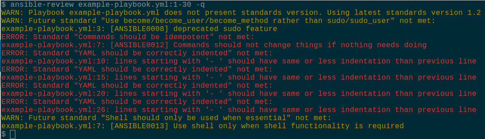

% Automating Ansible Code Reviews
% Will Thames
% 02 June 2016


# Why have code reviews?

* Spot bugs earlier
* Avoid unnecessary code (YAGNI)
* Encourage reuse (DRY)
* Avoid technical debt

# Learning from reviews

* More heads => neater code
* Provides a means of building trust in new
  contributors
* Allows new contributors to learn from
  reviews

# Why have standards?

* Consistency of code base, improves
  readability
* Rules are browsable, rather than found
  at review time.
* Standardise ahead of time, rather than
  arguing at review time
* Document best practices, and enforce them.

# How do we manage standards?

* standards are testable, best practices
  are guidance
* review process for new standards
* changes to standards cause version to
  be incremented

# Main rule of code reviews

* It is not permissable to block a code
  review on an undocumented rule.
* This means writing new rules as new
  best practices are 'discovered'

# What standards exist?

* Ansible documents some [Best practices for
  playbooks](http://docs.ansible.com/ansible/playbooks_best_practices.html)
* We have our own standards for consistency sake
    - whitespace
    - role versioning
    - roles
    - variable declaration location
    - idempotency

# Standards evolve


# Why automate reviews?

* Avoids the boring bits of code reviews
* Automated checks can be performed *before*
  even committing.
* Actual code reviews seem less pedantic

# Inspiration

* [Alexandra & Matt's talk](https://www.youtube.com/watch?v=yPy44B9h820)
  on making the Right Way the Easy Way
* Have a versioned set of standards
* Test deployments against those standards 

# Ansible-review
* https://github.com/willthames/ansible-review
* Runs on individual files or even lines of
  individual files (good for diffs)
* Needs a set of standards rules to be defined
* Roles and playbooks must declare standards
  version (e.g. `# Standards: 1.2` in `meta/main.yml`)

# Ansible-lint

* [ansible-lint](https://github.com/willthames/ansible-lint)
  comes with a bunch of builtin rules (more with v3.0)
    - repeatability
    - idempotency
    - readability
    - etc.
* Added some internal ansible-lint rules to our repo too.

# Ansible-review standards

* Based on ansible-lint checks
* Or write your own check in python
* A check takes a filename and settings
* And returns a `Result` object, which is
  effectively a list of `Error`s.

# A sample standard rule

```
become_rather_than_sudo = Standard(dict(
    name = "Use become/become_user/become_method " \
           "rather than sudo/sudo_user",
    check = lintcheck('ANSIBLE0008'),
    types = ["playbook", "task"]
    version = "0.9"
))

standards = [
  become_rather_than_sudo,
  ...
]
```

# Warnings

For things that aren't yet standards but are
worth knowing about (e.g. deprecated behaviour),
a standard without a version will never error,
only warn.

# Ansible-review benefits

* Can review specific lines in set of files
  `ansible-review playbook.yml:14-18 otherthing.yml`
* Can control which checks are important
* Can review older code against older versions for
  minor changes

# Running ansible-review

* `git ls-files | xargs ansible-review`
* `git diff master | ansible-review`
* As a commit hook (add `-q` for just errors and warnings)

# Results



# Conclusions

* ansible-review has helped in the review of around 10
  internally developed ansible roles so far
* Few false positives.

# Thanks

https://willthames.github.io/devops-bris-ignite
