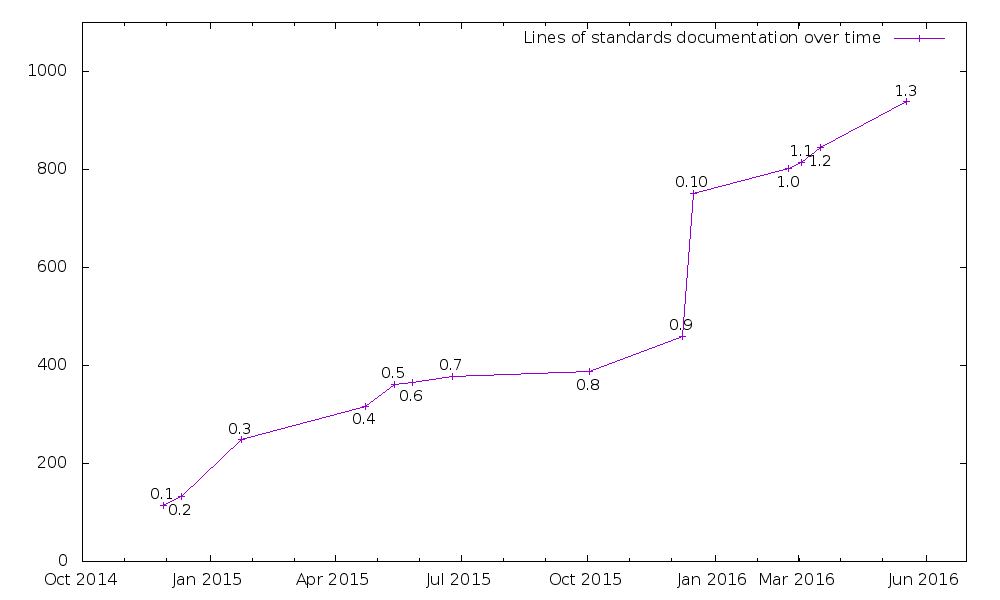

% Automating Ansible Code Reviews
% Will Thames
% 02 June 2016

# Why have code reviews?

* Spot bugs earlier
* Avoid unnecessary code
* Encourage reuse
* Avoid technical debt
* More heads => neater code

# Why have standards?

* Consistency of code base, improves
  readability
* If you can standardise up-front, it saves
  arguments at review time
* Document best practices, and enforce them.

# What standards exist?

* Ansible documents some Best practices
* We have our own for consistency sake
    - whitespace
    - role versioning
    - roles
    - variable declaration location

# How do we manage standards?

* standards are versioned
* review process for new standards

# Standards over time



# Why automate reviews?

* Avoids the boring bits of code reviews
* Automated checks can be performed *before*
  even committing.
* Actual code reviews seem less pedantic

# Ansible-Review

* Took inspiration from
  [Alexandra & Matt](https://www.youtube.com/watch?v=yPy44B9h820)
* Applys a set of rules that check for adherence
  to standards based on declared standards version
* https://github.com/willthames/ansible-review
* Runs on individual files or even lines of
  individual files (good for diffs)
* Very much designed to be pluggable for your
  own organisation's needs

# Ansible-lint exists too:

* [ansible-lint](https://github.com/willthames/ansible-lint)
  comes with a bunch of builtin rules (more with v3.0)
    - do package installs declare version
    - are commands run when ansible modules exist
    - are tasks named
* Added some internal ansible-lint rules to our repo too.

# Ansible-review standards

* Ansible-review can use ansible-lint as a basis for
  a standards check

  ```
  become_rather_than_sudo = Standard(dict(
      name = "Use become/become_user/become_method rather than sudo/sudo_user",
      check = lintcheck('ANSIBLE0008'),
      types = ["playbook", "task"]
  ))
  ```

* Or just write your own method to do the check.

# B
